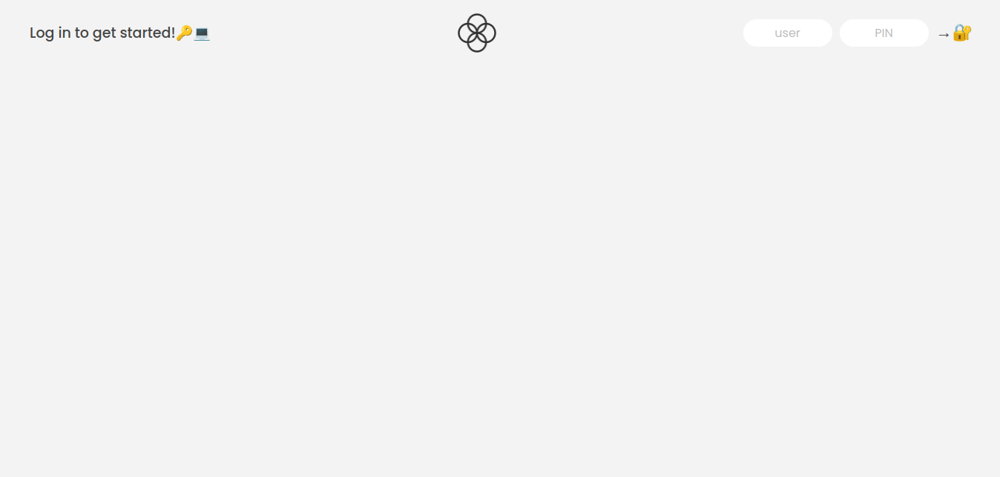
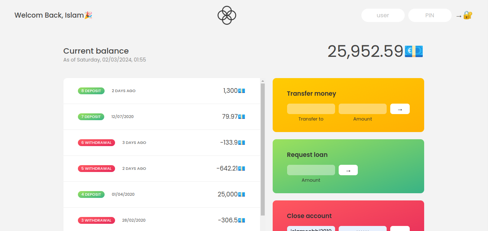

# Bankist Web Application 💼💰

Welcome to Bankist, a small web application designed to simulate an online bank! With Bankist, you can manage your money, view transactions, check balances, make withdrawals and deposits, request loans, transfer money between accounts, and even close your account. The application is built using HTML, CSS, and JavaScript, leveraging array methods, time and date methods, and number manipulation. 💻💸

## Demo 🎬

## Features 🚀

- User authentication with individual accounts 🔐
- Session timeout after 5 minutes of inactivity ⏰
- View money flow and transaction history 📈💰
- Make withdrawals and deposits 💸💳
- Request loans 💰💼
- Transfer money between accounts 💸🔄
- Close account option 🚪❌

## Technologies Used 🛠️

- HTML
- CSS
- JavaScript

## Usage 📋

To run the application locally:

1. Clone this repository.
2. Open the `index.html` file in your web browser.

## Author 🧑‍💻

Bankist is created with ❤️ by Islam Sobhy Eladly.

- LinkedIn: [Islam Sobhy Eladly](https://www.linkedin.com/in/islam-sobhy-eladly/)

Based on Jonas Schmedtmann JavaScript Course @[The Complete JavaScript Course 2024: From Zero to Expert!](https://www.udemy.com/course/the-complete-javascript-course/?couponCode=KEEPLEARNING)
